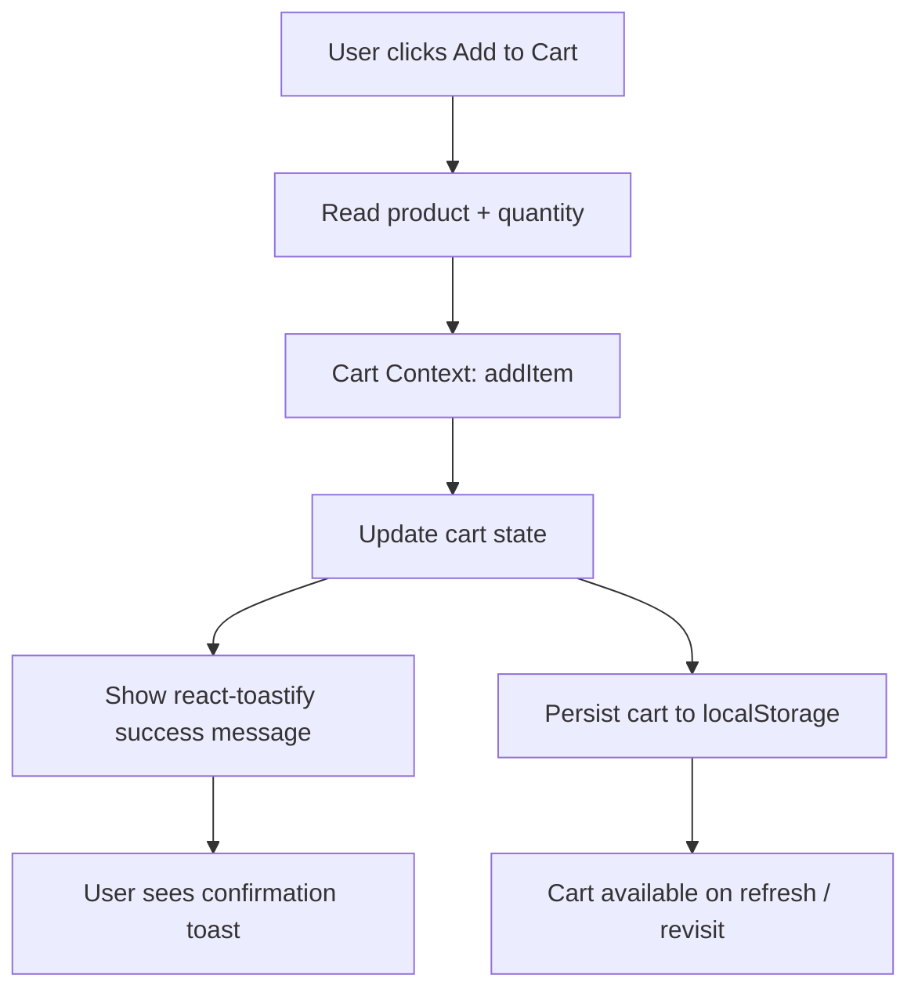

# Add to Cart Flow

```mermaid
flowchart TD
  A[User clicks Add to Cart] --> B[Read product + quantity]
  B --> C[Cart Context: addItem]
  C --> D[Update cart state]
  D --> E[Show react-toastify success message]
  D --> F[Persist cart to localStorage]
  F --> G[Cart available on refresh / revisit]
  E --> H[User sees confirmation toast]
```
